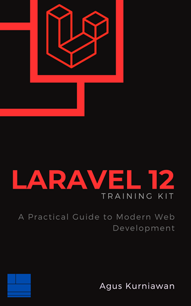

# Laravel 12 Training Kit: A Practical Guide to Modern Web Development

*Laravel 12 Training Kit: A Practical Guide to Modern Web Development* is a project-based book that helps readers build real-world Laravel applications through a practical, hands-on approach. Written for beginners, students, and developers upgrading to Laravel 12, this book covers the entire development workflow—from installation and environment setup to building full-stack apps and deploying them to production. Each topic is designed to be immediately applicable, reinforced by step-by-step exercises that guide readers through building modern, scalable, and secure web applications.

✨ Highlight Topics You’ll Learn from This Book

* Hands-on introduction to Laravel 12 with over 50 real-world lab exercises
* Building RESTful APIs with authentication using Laravel Sanctum
* Implementing form validation, custom rules, and AJAX-based submissions
* Using Blade components, layout theming, and reusable views
* Managing file uploads with local and S3-compatible storage like MinIO
* Creating CRUD apps using Eloquent ORM and Query Builder
* Using MongoDB with Laravel, including embedded relationships and pagination
* Applying the Repository Pattern and Dependency Injection in Laravel
* Authentication and role-based authorization with Laravel Breeze and Socialite
* Full-stack development with Laravel API and React/Vue.js UI
* Security best practices: XSS, SQL injection, CSRF, and HTTPS hardening
* Real-world deployment with Docker and production-ready Ubuntu setups
* Debugging with Laravel Telescope and monitoring application performance

This book is more than just a reference—it’s your practical lab manual for mastering Laravel 12 through real coding experiences. Every concept is immediately followed by an exercise, allowing you to build skills and projects side by side. Whether you're learning Laravel for the first time, teaching in a classroom, or building enterprise-grade applications, this book equips you with structured, proven guidance to become job-ready with the latest Laravel practices.

## Hands-on Lab Exercises

This book includes over 50 hands-on lab exercises that cover a wide range of topics in Laravel 12. Each exercise is designed to reinforce the concepts learned in the corresponding chapter, providing practical experience in building web applications. Here’s a list of the exercises included:

* Exercise 1: Creating Your First Laravel 12 Web Application
* Exercise 2: Creating a Route, Controller, and Blade View in Laravel 12
* Exercise 3: Creating a Laravel 12 Web Calculator
* Exercise 4: Handling Request and Returning Views in Laravel 12
* Exercise 5: Use Route Grouping for Clean Definitions in Laravel 12
* Exercise 6: Prefix Grouping with Route Namespaces in Laravel 12
* Exercise 7: Exploring Dependency Injection in Laravel 12
* Exercise 8: Contextual Binding with Dependency Injection in Laravel 12
* Exercise 9: Dynamic Service Binding Based on Config or Environment
* Exercise 10: Passing Data from Controller to Blade View
* Exercise 11: Use Blade Control Structures
* Exercise 12: Layout and Personalization in Laravel 12 with Bootstrap
* Exercise 13: Using Partial Views in Laravel 12
* Exercise 14: Using Blade Components in Laravel 12
* Exercise 15: Implementing Light and Dark Themes in Laravel 12
* Exercise 16: Handle Form Submission with Validation in Laravel 12
* Exercise 17: Custom Validation Rules and Messages in Laravel 12
* Exercise 18: Use Regex and Conditional Validation in Laravel 12
* Exercise 19: Multi-Step Form Submission with Session Data in Laravel 12
* Exercise 20: Form Submission with AJAX and Validation Response in Laravel 12
* Exercise 21: Using Model for Form Binding and Display
* Exercise 22: Build and Use a Data Transfer Object (DTO)
* Exercise 23: Use Model Accessors and Mutators
* Exercise 24: Upload and Display Image
* Exercise 25: Upload and Display Image to MinIO (S3-Compatible)
* Exercise 26: Upload and Display Image from Private Storage
* Exercise 27: Upload and Display Image to MinIO using Signed URLs
* Exercise 28: Building a Simple Todo Web App with Eloquent ORM and SQLite
* Exercise 29: Building a Simple Todo Web App with Laravel 12, Eloquent ORM, and MySQL
* Exercise 30: Eloquent ORM Relationships: One-to-One, One-to-Many, Many-to-Many
* Exercise 31: Pagination with Eloquent ORM (SQLite)
* Exercise 32: Performing CRUD with Query Builder in Laravel 12
* Exercise 33: Query Builder for Joins, Aggregate, and Filtering
* Exercise 34: Query Builder with Raw Expressions and Secure Input Parameters
* Exercise 35: Implementing Repository Pattern using Query Builder
* Exercise 36: CRUD Web App with MongoDB in Laravel 12
* Exercise 37: MongoDB Embedded Relationships with Laravel 12
* Exercise 38: Data Pagination with MongoDB in Laravel 12
* Exercise 39: Authentication and Authorization with Laravel 12 Breeze
* Exercise 40: Restrict Access Based on Role in Laravel 12
* Exercise 41: Authentication with Google using Laravel Socialite in Laravel 12
* Exercise 42: Building a “Hello World” REST API in Laravel 12
* Exercise 43: Building a Calculator REST API in Laravel 12
* Exercise 44: Creating a CRUD Resource REST API
* Exercise 45: Upload File via REST API with Form Data in Laravel 12
* Exercise 46: Authentication & Authorization REST API
* Exercise 47: Full Stack Product CRUD with Laravel 12 API and React UI
* Exercise 48: Full Stack Product CRUD with Laravel 12 API and Vue.js UI
* Exercise 49: Exploring Laravel Telescope in Laravel 12
* Exercise 50: Deploying Laravel 12 to Production on Ubuntu Server with PHP 8.4
* Exercise 51: Deploying Laravel 12 to Production in Docker on Ubuntu Server

## How to Buy

You can buy this book the following online stores:

* Google Play Books: https://play.google.com/store/books/details?id=4ipiEQAAQBAJ 
* Lulu: https://www.lulu.com/shop/agus-kurniawan/laravel-12-training-kit-a-practical-guide-to-modern-web-development/ebook/product-v8yg94n.html
* Apple iBookstore: http://books.apple.com/us/book/id6746777869
* Leanpub: https://leanpub.com/laravel12trainingkit
